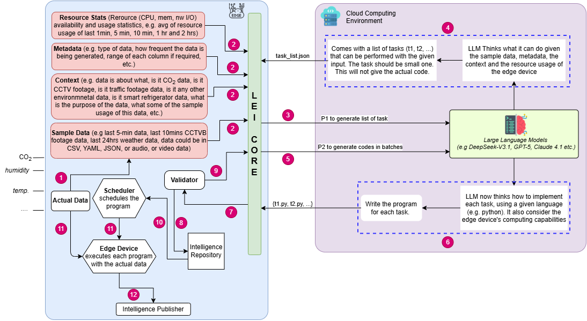

# LEI (LLM-Assisted Edge Intelligence)

## Introduction

LLM-assisted Edge Intelligence (LEI) bridges the gap between powerful cloud-based large language models and resource-constrained edge devices by enabling automated generation, validation, and deployment of lightweight programs on edge device.

## Control Flow of LLM-Assisted Edge Intelligence


## Description
1. Input Layer
    * **Sample Data** (e.g., last 5-min sensor readings, weather logs) → Can be in CSV, JSON, or YAML format.
    * **Metadata** (e.g., data type, generation frequency, range of values).
    * **Context** (e.g., domain knowledge, use case").

2. LLM Processing Layer (Cloud Computing Environment)
    * Uses advanced LLMs (e.g., GPT-5, DeepSeek-V3.1, Claude 4.1, Grok 4).
    * The LLM:
        * Analyzes the provided sample data, metadata, and context.
        * Thinks about what can be done with this data — identifies small, discrete tasks (t1, t2, …).
        * Writes small programs for each task, considering the programming language (e.g., Python) and edge device capability.
        * Sends all task programs and their descriptions to the edge device.

3. Edge Execution Layer
    * Edge Device receives the program(s) from the cloud.
    * Executes each program locally using actual live data (temperature, humidity, etc.).
    * Performs computations near the source, reducing latency and bandwidth usage.

4. Output Layer
    * Edge devices return processed outputs or inferences back to the cloud (if needed).
    * Enables distributed, low-latency intelligence while the LLM orchestrates logic and code generation dynamically.


# File structure

```
LEI-LLM-assistedEI/
│
├── config.py                          # Generic LLM configuration (provider, API keys, model)
├── pipeline.py                        # Main orchestrator: runs Steps 1-4 sequentially
├── resource_monitor.py                # Utility: logs CPU, memory, network metrics (used by all steps)
│
├── task_generator.py                  # Step 1: Generate task list from data + LLM
├── code_generator.py                  # Step 2: Generate Python code for each task
├── validator.py                       # Step 3: Validate and fix generated code
│
├── scheduler/
│   └── edge_scheduler_sequential.py   # Step 4: Execute validated tasks
│
├── prompts/                           # LLM prompt templates
│   ├── get_tasks.py
│   ├── get_code.py
│   └── get_validated.py
│
├── data/                              # Input layer: sample data, metadata, context
│   ├── air_quality/
│   ├── soil/
│   ├── temp_humidity/
│   └── wind/
│
├── generated_tasks/                   # Output from Steps 1-2: task lists and generated scripts
│   ├── <DATA_TYPE>/
│   │   ├── tasks_list.json
│   │   ├── task1_*.py
│   │   ├── task2_*.py
│   │   └── ...
│
├── output/                            # Output from Step 4: task execution results
│   └── <DATA_TYPE>/
│       ├── task_output_*.json
│       └── ...
│
├── timestamp_path/                    # Execution timing logs for each step
│   └── <DATA_TYPE>/
│       ├── pipeline_timestamp_*.csv
│       ├── resource_usage_step1_*.csv
│       ├── resource_usage_step2_*.csv
│       ├── resource_usage_step3_*.csv
│       └── resource_usage_step4_*.csv
│
└── Utility & Analysis (Independent)
    ├── resource_stat/
    │   ├── resource_stat.py           # Background monitor: logs system resource usage
    │   └── stop_monitor.py            # Utility: stops the background monitor
    │
    ├── publish_intelligence/
    │   └── edge_dashboard.py          # Visualization (not integrated in pipeline)
    │
    └── result_code/                   # Testbed analysis & reporting
        ├── result_*.py                # Individual step analysis scripts
        ├── combine_cases_plots.py      # Cross-step visualization & comparison
        └── res_complete_pipeline.py    # End-to-end pipeline result summary
```

## Pipeline Steps (Steps 1-4)

### Step 1: Task Generator
`task_generator.py` analyzes input data (sample data, metadata, context) and uses an LLM to identify discrete tasks.

* Reads `sample_data.csv`, `metadata.json`, `context.txt` from `data/<DATA_TYPE>/`
* Uses LLM to analyze patterns and generate task descriptions
* Outputs: `generated_tasks/<DATA_TYPE>/tasks_list.json`
* Logs resource metrics to `timestamp_path/<DATA_TYPE>/`

### Step 2: Code Generator
`code_generator.py` generates executable Python code for each identified task.

* Reads task list from Step 1
* Uses LLM to write production-ready Python code
* Outputs: `generated_tasks/<DATA_TYPE>/task*.py` scripts
* Logs resource metrics and code generation stats

### Step 3: Validator
`validator.py` executes and validates generated code.

* Runs each task script with test data
* Validates execution, error handling, output format
* Auto-corrects failures via LLM-assisted code repair
* Outputs: validation summaries and metrics
* Logs resource metrics and validation stats

### Step 4: Edge Scheduler
`scheduler/edge_scheduler_sequential.py` executes validated tasks sequentially.

* Discovers and runs all scripts in `generated_tasks/<DATA_TYPE>/`
* Collects execution results and timings
* Outputs: `output/<DATA_TYPE>/task_output_*.json`
* Logs resource metrics and execution stats


## Independent Components (Not in Main Pipeline)

* **resource_monitor.py** — Captures system metrics (CPU, memory, network I/O, temperature) and logs to CSV for performance evaluation across all pipeline steps.
* **resource_stat/** — Background monitor (`resource_stat.py`, `stop_monitor.py`) that runs concurrently to track overall system load; generates `resource_usage_summary.json` for adaptive task generation.
* **result_code/** — Post-execution analysis tools (`result_step*.py`, `result_avg_cpu.py`, `combine_cases_plots.py`) for evaluating pipeline performance and comparing results across runs.
* **publish_intelligence/edge_dashboard.py** — Streamlit dashboard for real-time visualization (under development, not yet integrated in pipeline).

# How to execute?

## Clone the Repository
```
git clone https://github.com/your-username/LEI-LLM-assistedEI.git
cd LEI-LLM-assistedEI
```

## Setup
1. Set up your Python virtual environment:
   ```
   python -m venv venv
   ```
   * Windows: `venv\Scripts\activate`
   * Linux/macOS: `source venv/bin/activate`

2. Install dependencies:
   ```
   python -m pip install --upgrade pip
   pip install -r requirements.txt
   ```

3. Configure your environment:
   * Set your LLM API key: `export LLM_API_KEY="your_api_key_here"` (or set `OPENAI_API_KEY` or `GEMINI_API_KEY` as needed)
   * Update `config.py` to set `DATA_TYPE` (e.g., `DATA_TYPE="air_quality"`)

## Run the complete pipeline

**Recommended: Start resource monitor first** (optional but useful for performance tracking):
```
python resource_stat/resource_stat.py &
```
This runs in the background and logs system metrics to `resource_stat/resource_usage_summary.json`.

**Then run the pipeline:**
```
python pipeline.py
```
This executes Steps 1–4 sequentially for 5 runs with the configured model, logging all results and performance metrics.

**Later, stop the background monitor:**
```
python resource_stat/stop_monitor.py
```

## Run individual steps
* **Step 1 – Generate task list:**
  ```
  python task_generator.py
  ```

* **Step 2 – Generate code for tasks:**
  ```
  python code_generator.py
  ```

* **Step 3 – Validate generated code:**
  ```
  python validator.py
  ```

* **Step 4 – Execute tasks on edge:**
  ```
  python scheduler/edge_scheduler_sequential.py
  ```
## Future Work

- Publish Intelligence (Dashboard Enhancement)
- Scheduler Algorithm Improvements

## License (To Add)
This project is open-source and available under the MIT License. See LICENSE file for details.
