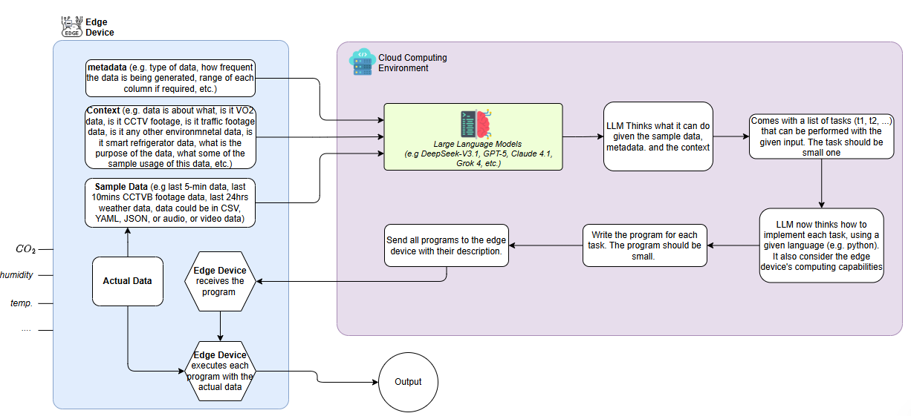

# Basic control Flow of LLM-Assisted Edge Intelligence

## Description
1. Input Layer
    * Sample Data (e.g., last 5-min sensor readings, CCTV clips, weather logs) → Can be in CSV, JSON, YAML, audio, or video formats.
    * Metadata (e.g., data type, generation frequency, range of values).
    * Context (e.g., data domain—traffic, environmental, physiological, etc., and its purpose).

2. LLM Processing Layer (Cloud Environment)
    * Uses advanced LLMs (e.g., GPT-5, DeepSeek-V3.1, Claude 4.1, Grok 4).
    * The LLM:
        * Analyzes the provided sample data, metadata, and context.
        * Thinks about what can be done with this data — identifies small, discrete tasks (t1, t2, …).
        * Writes small programs for each task, considering the programming language (e.g., Python) and edge device capability.
        * Sends all task programs and their descriptions to the edge devices.

3. Edge Execution Layer
    * Edge Device receives the program(s) from the cloud.
    * Executes each program locally using actual live data (temperature, humidity, etc.).
    * Performs computations near the source, reducing latency and bandwidth usage.

4. Output Layer
    * Edge devices return processed outputs or inferences back to the cloud (if needed).
    * Enables distributed, low-latency intelligence while the LLM orchestrates logic and code generation dynamically.

# File structure
## LLM Orchestrator 
`llm_orchestrator.py` script that takes three inputs (`sample_data.csv`, `metadata.json`, and `context.txt`) present in the `data` folder, sends them to an LLM (e.g., GPT-5), and receives a small Python program back (like “compute comfort index” or “detect anomaly”) ready to run on your edge device

* The LLM decides how many programs (`x`) it wants to generate, based on the given data, metadata, and context.
* Each generated program is stored separately (e.g., `task1_temperature_stats.py`, `task2_comfort_index.py`, etc.).
* Each file also has a short natural-language description that the LLM provides, helping the edge device understand what the code does.

__The LLM replies with:__

* A JSON-style response describing multiple tasks:
    * task name
    * task description
    * Python code for each.
* Save all task scripts automatically under /generated_tasks.
* Optionally print or log the generated task list.

## Edge executor
`edge_executor.py` that fulfills your two goals:
* Automatically runs all `.py` programs inside `/generated_tasks/`
* Logs execution time, success/failure, and any output/errors — simulating real edge device behavior

##  Web Dashboard
`edge_dashboard.py` visualizes the most recent results and runtime statistics.

# How to execute?
* `export OPENAI_API_KEY="your_api_key_here"`
* Step 1 – Generate Tasks (Cloud Simulation)
`python llm_orchestrator.py`
* Step 2 – Execute Tasks (Edge Simulation) `python edge_executor.py`
* Step 3 – Visualize Results (Dashboard)  `streamlit run edge_dashboard.py`

### for setting up virtual environment
* `python -m venv venv`
* in windows: `venv\Scripts\activate`
* in Linux: `source venv/Scripts/activate`
`python -m pip install --upgrade pip`
`pip install openai streamlit pandas numpy`

# TODO
